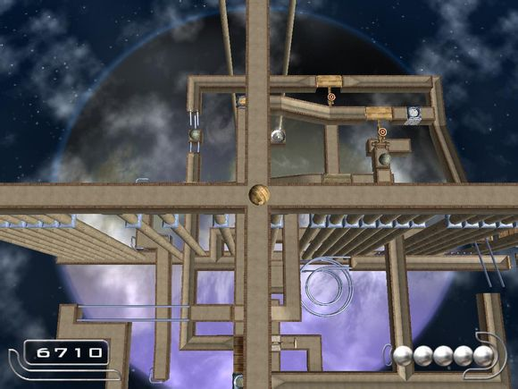

# 魔脓空间站

## 概览

|||
|:---|:---|
|地图名|魔脓空间站| 
|源语言名|魔脓空间站|
|作者|傲骨银狼ヶ璇|
|发布时间|2011年4月|
|小节数|6|
|授权类型|免费使用|
|适用于|Ballance, Ballance Remix|
|包含在地图包中|是|
|支持此地图的纪录认证者|Score Manager|

## 截图

## 下载

[Discord](https://cdn.discordapp.com/attachments/413502698143350799/413719315527892992/Moneng_Space.NMO)

## 视频


<iframe width="560" height="315" src="https://www.youtube.com/embed/o_pCj8kji34?rel=0" frameborder="0" allow="encrypted-media" allowfullscreen></iframe>


 XNjc5MTUwNzk2@@ 

## 评论

**qwezxc385** 在 Ballance吧 评论
> 很有创意的一张地图，排第一没意见
