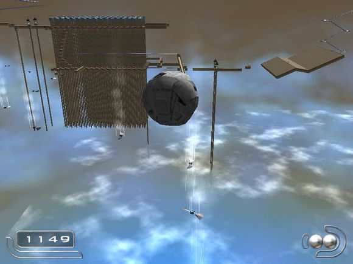

# 魔虬

## 概览

|||
|:---|:---|
|地图名|魔虬| 
|源语言名|魔虬|
|作者|失衡之梦|
|发布时间|2012年7月1日|
|小节数|8|
|授权类型|免费使用|
|适用于|Ballance|
|包含在地图包中|是|
|支持此地图的纪录认证者|Score Manager|

## 截图

## 下载

[Discord](https://cdn.discordapp.com/attachments/413502698143350799/413719322146373632/Moqiu.Level.NMO)

[Mediafire](https://www.mediafire.com/download/3q792b0250dun00)

## 视频


<iframe width="560" height="315" src="https://www.youtube.com/embed/wXxlhX8b8L8?rel=0" frameborder="0" allow="encrypted-media" allowfullscreen></iframe>


 XNjc5MzMzNjM2@@ 

## 评论

**qwezxc385** 在 Ballance吧 评论
> 很考验玩家耐心和细心的一个图，后来满屏虬字简直精神污染。。。密集恐惧的就别玩了
