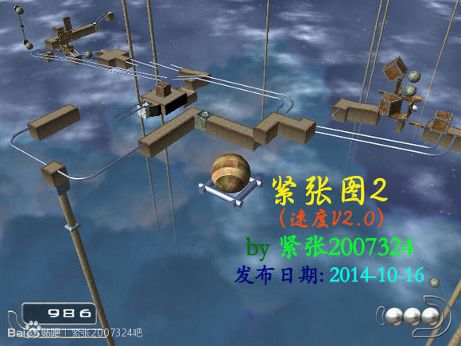

# 紧张图2

## 概览

|||
|:---|:---|
|地图名|紧张图2|
|源语言名|紧张图2|
|作者|紧张2007324|
|发布时间|2013年10月|
|小节数|7|
|授权类型|免费使用|
|适用于|Ballance|
|包含在地图包中|是|
|支持此地图的纪录认证者|无|

## 截图

## 下载

[MediaFire](https://www.mediafire.com/download/0vk71gw5elj3780)

## 视频

 XODAzNTAyMDEy@@ 

## 评论

**qwezxc385** 在 Ballance吧 评论

> 技术难度最大、节奏最快的地图。首次实现了蓝色柱子的渐变。是紧张比较好的作品。

