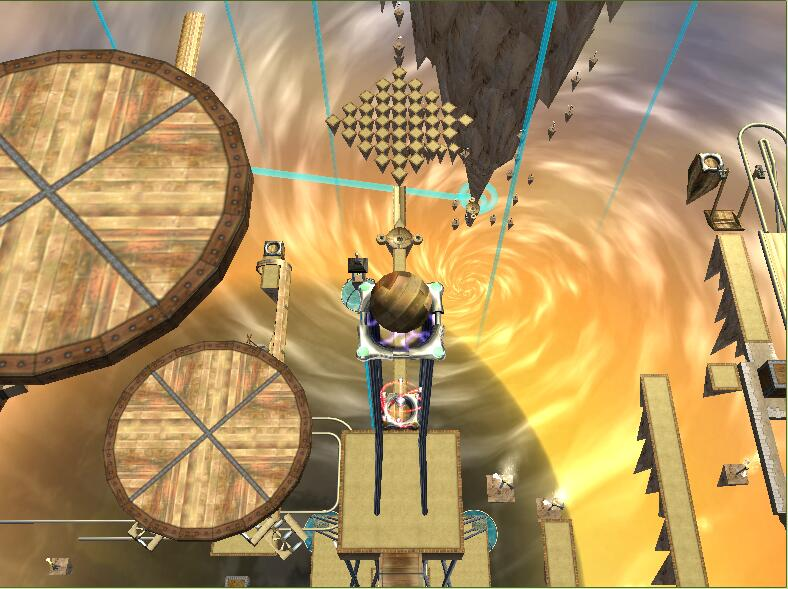

# 暮光之城

## 概览

|||
|:---|:---|
|地图名|暮光之城|
|源语言名|暮光之城|
|作者|Nice_Melodies|
|发布时间|2016年8月7日|
|小节数|7|
|授权类型|免费使用|
|适用于|Ballance|
|包含在地图包中|是|
|支持此地图的纪录认证者|无|

## 截图

## 下载

[Mediafire](https://www.mediafire.com/download/5ar6xgk2hwxr9c2)

## 视频

 XMTczNzYwMDI0OA==@@ 

## 评论

**qwezxc385** 在 Ballance吧 评论

> Nice_melodies的第一张自制地图，无论是细节还是创意都很不错。最重要的是地图的灯光 ...

