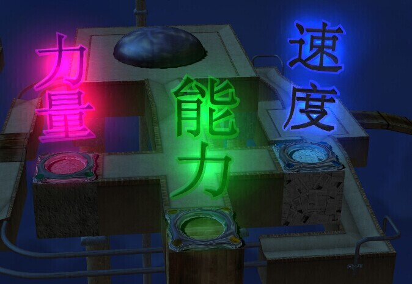
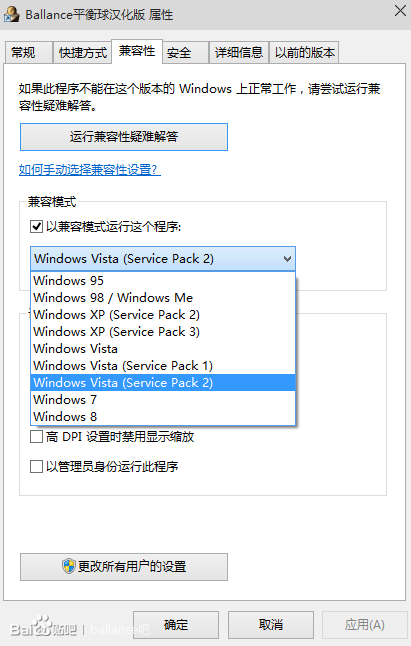

# Q&A

展开右上角的目录结构以便于您快速定位您想要查找的问题

## 玩Ballance有没有关于电脑的什么配置要求？

由于Ballance是ATARI十年前的作品，对配置的要求很低，即使很老的机子也可以带的起来。

## Ballance的基本操作有哪些？

方向键控制。左Shift键+左右方向键可以换视角；空格键可以拉开视角；Esc键可调出菜单。

## 如何去掉第一关的教程？

按Q键。

## 如何进入第13关？ 

在12关列表后有个**Twilight zone**，进入后鼠标点击**速度**即可进入13关。这个13关没有上锁，以便于玩家挑战13关。 

## 为什么我家的ballance只有【速度】一个关卡？



确实只有【速度】，没有另外两个关卡。此图为Ballance吧友所制作。

（当然后来也出现了吧友仿制的【伪】关卡）

## Ballance游戏中的分数是如何计算的？ 

```Level Bonus + Time Point + Extra lives = Score```

（即：关卡数 x 100 + 最终的时间得分 + 命的个数 x 200 = 最终得分）

* 第一关初始分数为1000，其他关卡均为999，所以在自制地图计算时放在第一关的要额外减一分
* 每碰一个分数球并被成功吸附可 + 220（100 + 20 * 6）Time Point，每吃一条命可以 + 200 Point 
* 当右下角时间归为0分时，仍可以继续游戏。

## 什么是HS、SR？ 

在Ballance的字典里，HS就是HighScore（常规得分），SR就是Speedrun（速度得分）。常规得分比的是得分，速度得分比的是耗时。

查看此百科的[竞速与纪录](/speedrun/MAIN.md)章节了解更多信息。

## 什么是“疯狂玩法”？

<!-- todo: 把技巧链接到本百科的部分 -->

疯狂玩法是根据Ballance制作中的一些BUG引申出来的两项技术。 包括：非90°视角旋转、高速球启动

<!--关于高速球，详见：http://tieba.baidu.com/p/2107176297-->

需要注意的是，使用上述技术玩出来的分数不能计入常规玩法中。

疯狂玩法也是一种纪录方式，受指定的纪录提供者支持，点击这里了解详细信息。

## 如何从容地驾驭单轨？

这个问题不好回答，因为驾驭单轨不是一天两天的事情，需要坚持练习来调整手感。最好的建议是去8、12关开头练习。

[点击此链接](/gameplaySkill/monorails.md)了解如何练习

## 怎么安装自制地图？

复制一份自制地图，找到安装游戏的位置，依次点开Ballance\3D Entities\Level，移动并替换Level_01.NMO~Level_13.NMO任一文件（注意文件名要完全符合，不然游戏读不出来）。最后进入游戏点开相应关卡即可。

## 怎么让游戏窗口化？

游戏窗口化需要调整注册表，首先Win+R调出运行，然后输入regedit回车，打开注册表编辑器。

对于32位系统，请定位到```HKEY_LOCAL_MACHINE/SOFTWARE/ballance/Settings```

对于64位系统，请定位到```HKEY_LOCAL_MACHINE/SOFTWARE/Wow6432Node/ballance/Settings```

之后你会在右侧列表找到一个叫做```Fullscreen```的项，双击即可修改，设置为0是窗口化，设置为1是全屏

> 系统位数可以右键计算机-属性查看  
> 切勿将其修改为其他数值，否则将不保证稳定性  

## Ballance有没有手机版？ 

没有。制作团队早在几年前就已解散，Ballance并没有其它任何附属产品。手机上的【七星传说】等游戏均为其他游戏团队仿制。

## Windows 8及以上系统打不开游戏怎么办？

首先，将Ballance安装目录下的Setup.exe的兼容性改一下，选择Windows Vista Service Pack 2然后确认即可。如下图所示：



> 如果仍然无法运行，请将其调整为Windows XP Service Pack 3再次尝试  
> 如果仍然无法运行，可以尝试以管理员身份运行  
> 如果此时仍然无法运行，请尝试安装一个Windows XP的虚拟机，这将保证您能完美地运行Ballance  
